# Contribution Guide

labelu-kit 是 [LabelU](https://github.com/opendatalab/labelU) 的最核心部分，它包含了图片、音频和视频的 Web 标注组件和应用程序。这个项目是 [OpenDataLab](https://opendatalab.com/) 开源项目之一，我们欢迎所有人参与贡献。

通过阅读这个文档，你将了解到如何参与到 labelu-kit 的开发中，并了解到整体设计的细节

## 如何启动开发环境

```bash
git clone https://github.com/opendatalab/labelU-Kit.git
```

项目使用 [pnpm](https://pnpm.io/) 作为包管理器和工作区管理，所以请确保你已经安装了 pnpm。

```bash
cd labelU-Kit
pnpm install
```

- 启动 Web 应用

```bash
cd apps/frontend
pnpm start
```

> 由于使用了 [vite-plugin-ts-mono-alias](https://www.npmjs.com/package/vite-plugin-ts-mono-alias)，所以启动 frontend 可以直接使用 packages 下的组件源码进行调试开发。

## 整体架构



### 说明

- `apps/frontend` 是 Web 应用程序；
- `apps/website` 是 标注套件的体验地址；
- `@labelu/audio-annotator-react`有大部分代码与`@labelu/video-annotator-react`相似，因此可以共享一些代码。
- 大部分相似的界面 UI 元素都在`@labelu/components-react`中实现。

### @labelu/image

在阅读 `@labelu/images` 代码之前，建议安装 [classdiagram-ts](https://marketplace.visualstudio.com/items?itemName=AlexShen.classdiagram-ts) 插件将 ts class 转换成类图来查看图片标注引擎代码库的整体结构。

在图片标注中，有以下几个基本要素：

- `Renderer` 渲染器
- `Axis` 坐标系
- `Shape` 图形
- `Event` 事件

另外，还抽象了以下几个概念：

- `Tool` 工具（画笔）
- `Draft` 草稿（正式的图形选中后进入的编辑状态）
- `Sketch` 草图（使用画笔绘制中的图形）
- `Drawing` 定稿（正式的图形）



在理解上述概念后，再阅读 [packages/image](./packages/image/src) 整体的代码结构会更加容易。

## 分支说明

- main 日常分支，将各自开发的功能合并到 main 分支；
- alpha 用于发布内部测试版本，由 main 分支合并；
- beta 用于发布公测版本，由 main 分支合并（此分支不活跃，通常是 alpha 发布测试完成后，直接由 main 分支合并到 release 分支）；
- release 用于发布正式版本，由 main 分支合并；
- online 区别于 main 分支，用于发布 LabelU 线上体验功能，常驻分支，定期同步 main 分支。

## 提交规范和语义化版本

我们使用 [commitlint](https://commitlint.js.org/) 和 [semantic-release](https://semantic-release.gitbook.io/semantic-release/) 来规范提交信息和版本发布。

具体的 commitlint 规则请查看 [commitlint-config](./.commitlintrc)。

同时遵循 semantic-release 默认的提交规范 [Angular Commit Message Conventions](https://github.com/angular/angular/blob/main/CONTRIBUTING.md#-commit-message-format)。

## CI/CD

### [build-package-test](./.github/workflows/build-package-test.yml)

main 分支的代码变动时会出发 package build 的 CI 流程，用于测试 packages 下的组件库是否可以正常构建。

### [playground](./.github/workflows/playground.yml)

当 release 更新时，会触发 playground 的 CI 流程，部署到 [https://opendatalab.github.io/labelU-Kit/](https://opendatalab.github.io/labelU-Kit/)

### [release](./.github/workflows/release.yml)

当 release 更新时，会触发 release 的 CI 流程，用于发布 npm 包；且在 github 创建一个 对应 package 和 frontend 的 [release](https://github.com/opendatalab/labelU-Kit/releases)。

> 前置条件：需要在 github 的仓库的 secrets 中配置 `NPM_TOKEN` 和 `GH_TOKEN`（如果在本机电脑登陆过 npm，npm token 可在 ~/.npmrc（Windows 下为 `C:/users/<username>/.npmrc`） 中获取）。

- mono-repo 下的 packages 使用的是 [multi-semantic-release](https://github.com/dhoulb/multi-semantic-release)；
- frontend 使用的是独立的 semantic-release；
- release 会通过 github [workflow_dispatch](https://github.blog/changelog/2020-07-06-github-actions-manual-triggers-with-workflow_dispatch/) 与 [labelu 的 ci](https://github.com/opendatalab/labelU/blob/main/.github/workflows/release_cicd_pipeline.yml) 协同，发布 labelu 的 release，协同方案见：[飞书文档](https://aicarrier.feishu.cn/wiki/wikcnEUfLmZc8rA378UuhHWC6Yt)。

### [release-online](https://github.com/opendatalab/labelU-Kit/blob/online/.github/workflows/release-online.yml)

当 online 更新时，会触发 release-online 的 CI 流程，用于发布 [LabelU 线上体验](https://labelu.shlab.tech/)功能，同时与内部的 Gitlab 仓库 [labelu-self](https://gitlab.shlab.tech/dps/labelu-self) 项目的 ci 协同。

由于内部的 gitlab ci 访问 github 有限制，所以在这个 workflow 中，会将 release 的产物上传到 [https://static-files.shlab.tech/download/labelU-Kit/releases/download/](https://static-files.shlab.tech/download/labelU-Kit/releases/download/)，方便内部的 gitlab ci 下载。相关的环境变量见 github 仓库 [settings](https://github.com/opendatalab/labelU-Kit/settings/secrets/actions)。

当 online 发布完成后，会通过 [gitlab trigger api](https://docs.gitlab.com/ee/ci/triggers/index.html) 触发 labelu-self 项目的 ci，进行线上体验功能的发布。
